# WIX1002_W02_Tutorial_1
### 📃 Question 1

### Request two numbers from the user and print the multiplication of the numbers.
#### 📊 IPO Model
| Input | Process | Output |
|----------|----------|----------|
| - number_1  <br> - number_2 | Multiple number_1 and number_2 | Product of number_1 and number_2
|
#### 💻 Pseudocode
```text
START 
    Read number_1, number_2
    product =  number 1 * number 2
    Display product 
END
```
#### 🧮 Flow Chart

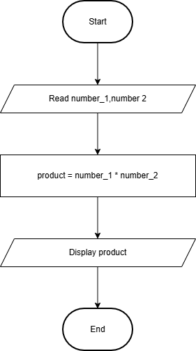

<br>
<br>

### 📃 Question 2

### Determine whether a random number is greater than 50.
#### 📊 IPO Model
| Input | Process | Output |
|----------|----------|----------|
| number | Check if number > 50 | Message "Yes" or "No"

#### 💻 Pseudocode
```text
START 
    Read number
    If number > 50 
        Display "Yes"
    Else
        Display "No"
    End If
END
```
#### 🧮 Flow Chart

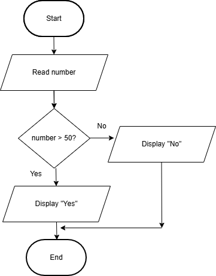

<br>
<br>

### 📃 Question 3

### Print the pass/fail grade based on the mark entered by user. The passing mark is at least 40.

#### 📊 IPO Model
| Input | Process | Output |
|----------|----------|----------|
| mark | Check if number >= 40 | Message "Pass" or "Fail" 


#### 💻 Pseudocode
```text
START 
    Read mark
    If mark >= 40
        Display "Pass"
    Else
        Display "Failed"
    End if
END
```
#### 🧮 Flow Chart

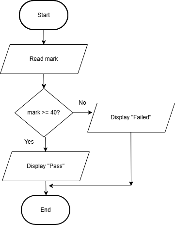


<br>
<br>

### 📃 Question 4

### Print the results of the two players’ dice game. 

#### 📊 IPO Model
| Input | Process | Output |
|----------|----------|----------|
| - dice1_value <br> -dice2_value | Compare the value for dice 1 and dice 2| Message of "Player 1 Win" or "Player 2 Win" or "Tie"

#### 💻 Pseudocode
```text
START 
    Read dice1_value,dice2_value
    If dice1_value > dice2_value
        Display "Player 1 Win"
    Else if dice2_value > dice1_value
        Display "Player 2 Win"
    Else
        Display "Tie"
    End If
END
```
#### 🧮 Flow Chart 

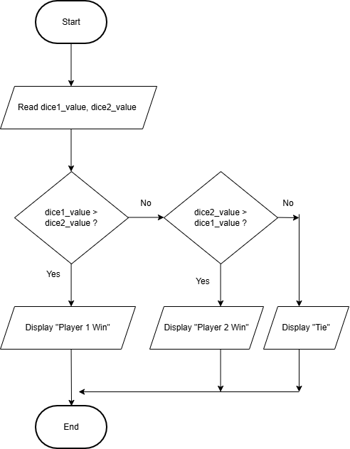

<br>
<br>

### 📃 Question 5

### Print the perimeter of a rectangle

#### 📊 IPO Model
| Input | Process | Output |
|----------|----------|----------|
| - length <br> - width | Calculate the perimeter based on length and width | perimeter


#### 💻 Pseudocode
```text
START 
    Read length,width
    perimeter = 2*(length + width)
    Display perimeter
END
```
#### 🧮 Flow Chart

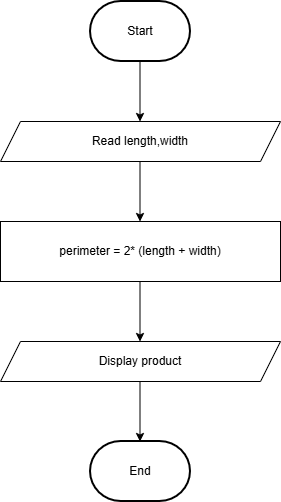

<br>
<br>

### 📃 Question 6

### Print the minimum number from 10 random numbers generated by computer

#### 📊 IPO Model
| Input | Process | Output |
|----------|----------|----------|
| - | - Generate 10 random numbers <br> - Find minimum of 10 random numbers using comparison| minimum of 10 random numbers


#### 💻 Pseudocode
```text
START 
    Initialize empty list numbers

    For i = 0 To 9
        Generate random_number
        numbers[i] = random_number
    End for

    min = numbers[0]

    For each number In numbers Do
        If number < min 
            min = number

    Display the minimum of 10 random number
END
```
#### 🧮 Flow Chart

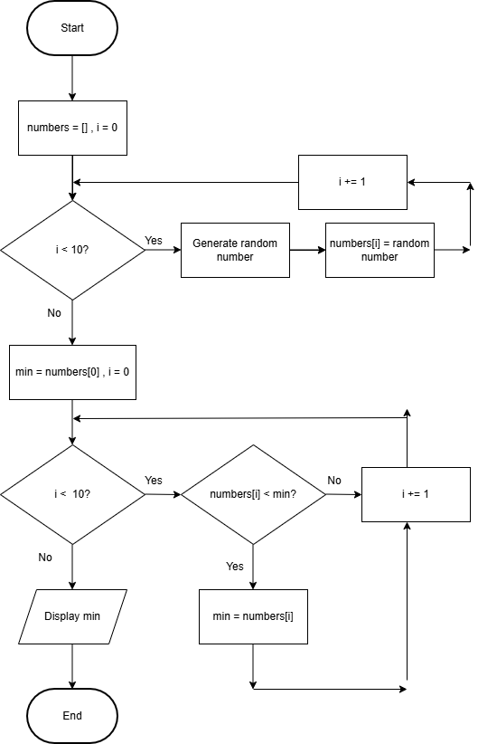

<br>
<br>

### 📃 Question 7

### Print the number of odd and even number from 10 random numbers generated by computer. The random number must be from 10 – 100.

#### 📊 IPO Model
| Input | Process | Output |
|----------|----------|----------|
| -  | - Generate 10 random numbers <br> - Check if each of number is odd then add to num_odd <br> - Check if each of number is even then add to num_even | - num_odd <br> - num_even


#### 💻 Pseudocode
```text
START 
    Initialize empty list numbers

    For i = 1 To 10 
        Generate random_number
        numbers[i] = random_number
    End for

    For each number in numbers 
        If number <= 100 and number >= 10 and number % 2 == 0
            num_even = num_even + 1
        Else 
            num_odd = num_odd + 1

    Display num_even, num_odd
END
```
#### 🧮 Flow Chart
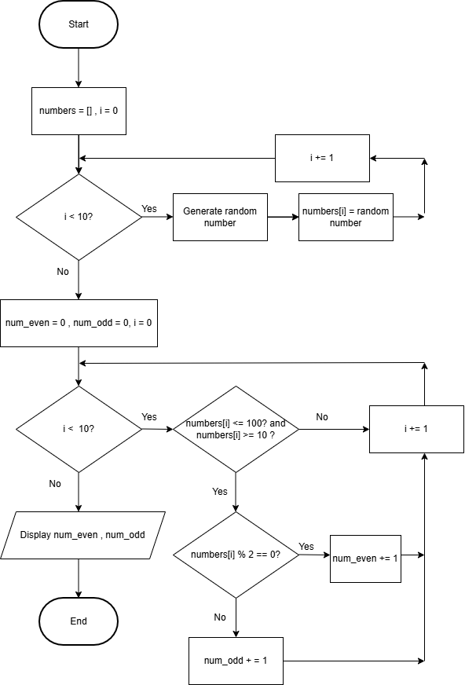

<br>
<br>

### 📃 Question 8

### Count the number of alphabet U and M from a sentence entered by user.

#### 📊 IPO Model
| Input | Process | Output |
|----------|----------|----------|
| sentence | Count the number of alphabet "U" and "M" in sentence| - num_u <br> - num_m


#### 💻 Pseudocode
```text
START 
    Read sentence
    For each alphabet in sentence
        If alphabet == "U"
            num_u += 1
        Else if alphabet == "M"
            num_m += 1
        End If
    End For
    Display num_u,num_m
END
```
#### 🧮 Flow Chart

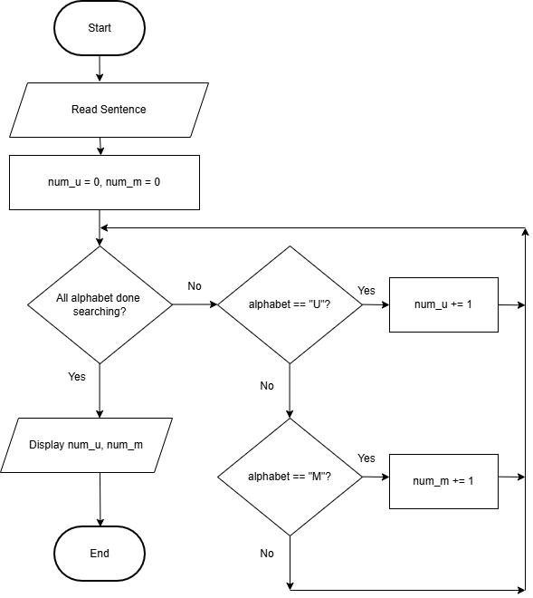

<br>
<br>

### 📃 Question 9

### Display the frequency of a keyword from a web page.

#### 📊 IPO Model
| Input | Process | Output |
|----------|----------|----------|
| keyword | Count the frequency of keyword in web page| frequency


#### 💻 Pseudocode
```text
START 
    Read keyword
    For each word in web page
        If word == keyword
            frequency += 1
        End if
    End For
    Display frequency
END
```
#### 🧮 Flow Chart

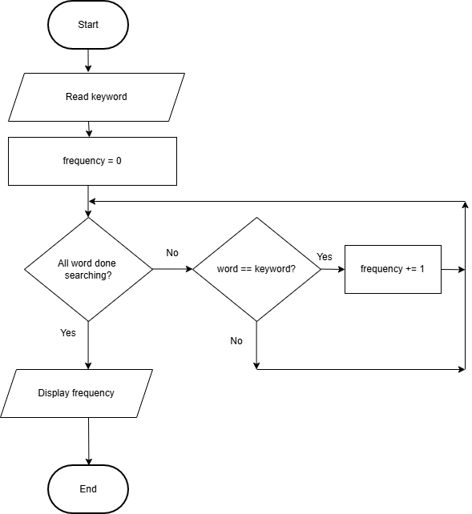

<br>
<br>

### 📃 Question 10

### Display the number of female student from a random list of 100 students.

#### 📊 IPO Model
| Input | Process | Output |
|----------|----------|----------|
| - |- Generate 100 student's gender <br> - Count the number of female student| num_female


#### 💻 Pseudocode
```text
START
    Initialize empty list genders
    For i = 1 To 100 
        Generate random_char 'M' or 'F'
        genders[i] = random_char
    End for

    For each gender in genders
        If gender == "F"
            num_female += 1
        End If
    End For
    Display num_female
END
```
#### 🧮 Flow Chart
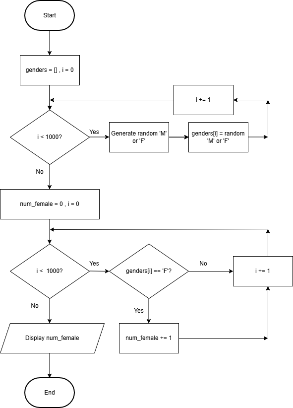

<br>
<br>

### 📃 Question 11

### Display a list of 5 random numbers in descending order. (Sort)

#### 📊 IPO Model
| Input | Process | Output |
|----------|----------|----------|
| - |- Generate 5 random number <br> - Store them in a list <br> - Sort the list in descending order| sorted list


#### 💻 Pseudocode
```text
START 
    Initialize empty list numbers

    For i = 0 To 4
        Generate random_number
        Set numbers[i] = random_number
    End for

    temp = 0

    For i = 0 To 4
        For j = 0 To (4-i-1) 
            If numbers[j] < numbers[j+1]
                temp = numbers[j]
                numbers[j] = numbers[j+1]
                numbers[j+1] = temp
            End If
        End For
    End For 

    Display numbers list
END
```
#### 🧮 Flow Chart
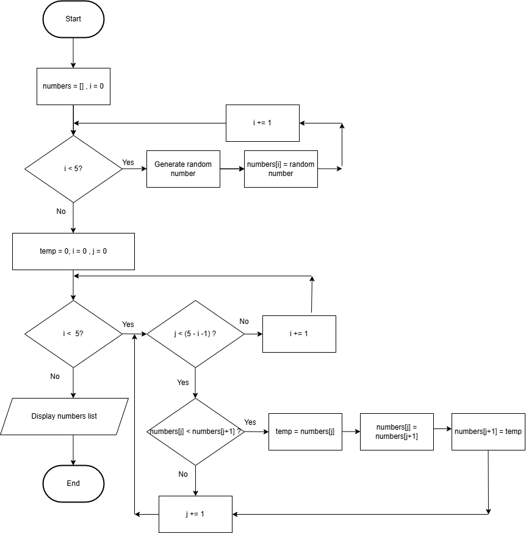

<br>
<br>

### 📃 Question 12

### Guess a random number generated by computer

#### 📊 IPO Model
| Input | Process | Output |
|----------|----------|----------|
| guess |- Generate a random number - Check if guess same with random number| Message "Correct" or "Wrong"


#### 💻 Pseudocode
```text
START 
    Generate random number
    Read guess 
    If guess == random number
        Display "Correct"
    Else
        Display "Wrong"
END
```
#### 🧮 Flow Chart
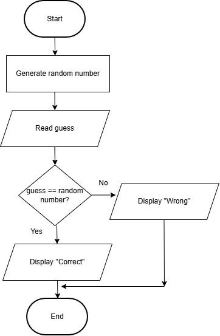

